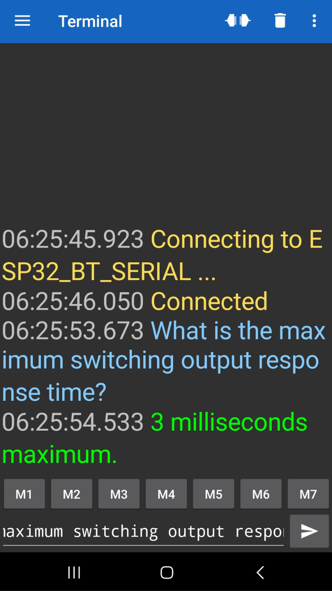

&nbsp;
&nbsp;
<p align="center">
  
</p> 
&nbsp;

# Embedded Language Models for Question and Answer in Industrial Equipment Assistance

### ✍🏾 Authors
[Thommas K. S. Flores](https://github.com/thommaskevin), [João Carlos N. Bittencourt](https://github.com/), [Thiago C. Jesus](https://github.com/), [Daniel G. Costa](https://github.com/daniel-gcosta) and [Ivanovitch Silva](https://github.com/ivanovitchm)


This repository provides the **code, datasets, and experimental resources** supporting the paper:

> **Embedded Language Models for Question and Answer in Industrial Equipment Assistance**  
> *Presented at CBA 2026 (XXV Congresso Brasileiro de Automática)*

The study proposes an **end-to-end pipeline for offline technical question answering** on microcontroller-class hardware, targeting **Industry 4.0** scenarios where connectivity is restricted. It integrates synthetic question–answer generation from industrial manuals, training of a **decoder‑only Extreme Small Language Model (Extreme SLM)**, conversion to **self‑contained C++ code**, and deployment on an **ESP32** platform with **Bluetooth** interaction—all without cloud dependence.


## 📁 Repository Structure

```plaintext
CBA2026_QA_INDUSTRIAL/
├── arduino_code
├── data/
│   ├── CAT-4083-UK.pdf
│   └── dataset_CAT-4083-UK.json
├── figures/
├── results/
│   ├── cpp_models/
│   ├── evaluations/
│   └── json_models/
├── hyperparameter_search_summary.csv
├── hyperparameter_search_summary.json
├── src/
│   ├── model/
│   ├── utils/
│   ├── __init__.py
│   └── slm.py
├── .gitignore
├── 01_dataset_generator.ipynb
├── 02_training_model.ipynb
├── 03_result_visualization.ipynb
├── LICENSE
├── README.md
└── requirements.txt
```

---

## 📤 Installation

* **Python 3.9+** is recommended.
* **Ollama** must be installed locally to run Qwen3‑Coder for dataset generation.
* **Arduino IDE** or **PlatformIO** is required for ESP32 deployment.

Clone the repository:

```bash
git clone https://github.com/<your-org>/Extreme-TinyGPT-Industrial-QA.git
cd Extreme-TinyGPT-Industrial-QA
```


Create a virtual environment:

```bash
python -m venv venv
```

Activate the environment:

```bash
source venv/bin/activate      # Linux/macOS
venv\Scripts\activate         # Windows
```

Install dependencies:

```bash
pip install -r requirements.txt
```

## 📚 Jupyter Notebooks

-  [](https://github.com/conect2ai/CBA2026_QA_Industrial/blob/main/01_dataset_generator.ipynb)  Dataset generator

-  [](https://github.com/conect2ai/CBA2026_QA_Industrial/blob/main/02_training_model.ipynb)  Training model

-  [](https://github.com/conect2ai/CBA2026_QA_Industrial/blob/main/03_result_visualization.ipynb) Result visualization


## 📚 Arduino Code

-  []( ) SLM with bluetooth communication


## 📚 Dataset

The corpus is derived from the technical manual of a **smart pressure valve**. The pipeline:

1. **Extracts** text from PDF pages.  
2. **Chunks** content using structure‑aware boundaries (headings, chapters).  
3. **Filters** low‑value segments (headers, footers, page numbers).  
4. **Generates** synthetic Q&A pairs using **Qwen3‑Coder** (served via Ollama).  
5. **Verifies** each pair with an **LLM‑as‑a‑judge** step (labels: `high`, `low`, `rejected`).

The final dataset contains **verified Q&A pairs** in JSONL format, including source metadata and confidence labels.


## 🧠 Extreme SLM Architecture

The **Extreme SLM** is a **decoder‑only Transformer** with masked causal self‑attention, tailored for extreme resource constraints.

| Component            | Details                                      |
|----------------------|----------------------------------------------|
| Embedding dimension  | 12 or 24                                     |
| Attention heads      | 2 or 4                                       |
| Transformer layers   | 1 or 2                                       |
| Activation           | GeLU                                         |
| Context window       | 23 tokens                                    |
| Vocabulary size      | 1,707 tokens                                 |
| Framework            | PyTorch → C++ code generation                |

The model is trained with **cross‑entropy loss** on the synthetic Q&A pairs. After training, a custom exporter translates the weights into **static C++ arrays** and an **autoregressive inference loop** ready for embedded deployment.


## 🔧 Training & Hyperparameter Search

A grid search over **128 configurations** was performed, varying:

- Embedding dimension
- Number of heads
- Number of layers
- Dropout rate
- Learning rate
- Batch size
- Training epochs

**Key Finding:** Embedding dimension had the strongest influence on generation quality; depth and heads showed marginal effects at this scale.


## 🚀 On‑Device Deployment

The best Extreme SLM configuration was deployed on an **ESP32‑WROOM‑32 DevKit V1**:

| Metric                     | Value                 |
|----------------------------|-----------------------|
| **Flash usage**            | 1.20 MB              |
| **RAM usage (global)**     | 56.1 KB              |
| **Power consumption**      | 754.1 mW             |
| **Inference latency**      | 318 ms               |
| **Interaction**            | Bluetooth Serial      |

The firmware receives queries from an Android smartphone via Bluetooth, performs **autoregressive token generation**, and returns the answer **completely offline**.

<p align="center">
  
</p>


## 📊 Results Overview

- **Lowest test loss:** 6.933 (embedding=24, heads=4, layers=2)  
- **Best BLEU:** 0.156  
- **Exact match (non‑zero):** achieved in 14% of configurations  
- **Pareto‑optimal models:** 193–220 KB for ~8.5 test loss  

The **interactive response time** (including Bluetooth communication) was **~860 ms**, with **318 ms** of pure on‑device inference.


## 🧠 Conclusion

This work demonstrates a **complete, hardware‑aware pipeline** for embedding language‑model‑based technical assistance directly into **microcontroller‑class industrial devices**.  

The approach advances **offline, privacy‑preserving intelligence at the edge**, reducing reliance on cloud connectivity and specialized personnel. The main limitations—dataset size and context window—point to future work in **quantization, pruning, and hardware‑software co‑design**.


## 📄 License

This project is licensed under the [MIT License](LICENSE) – © 2026 Conect2ai.


